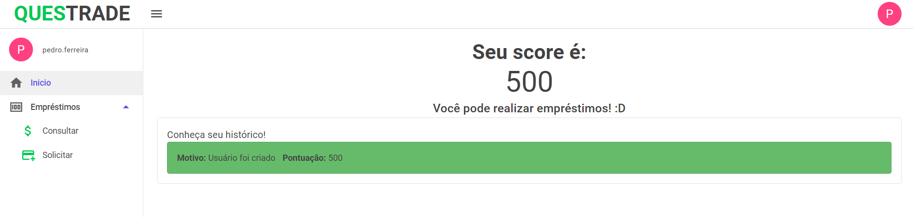
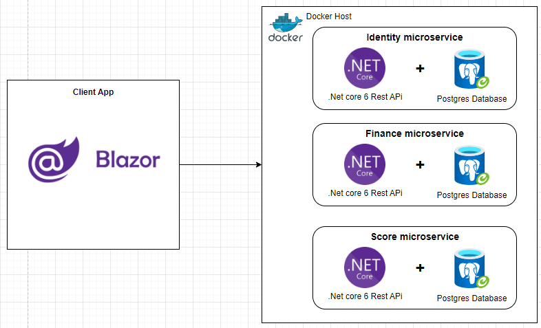
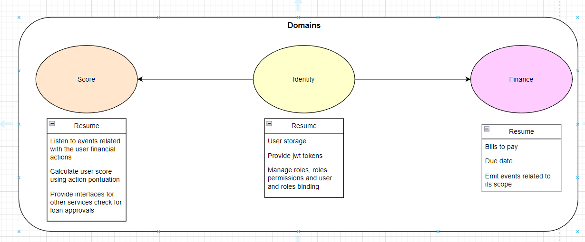
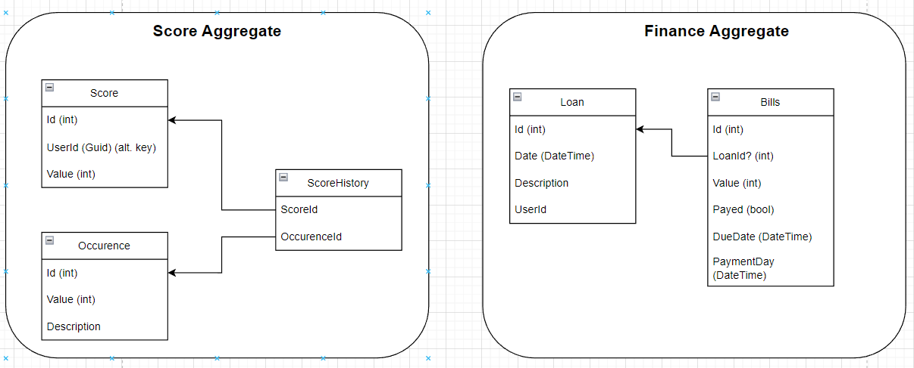
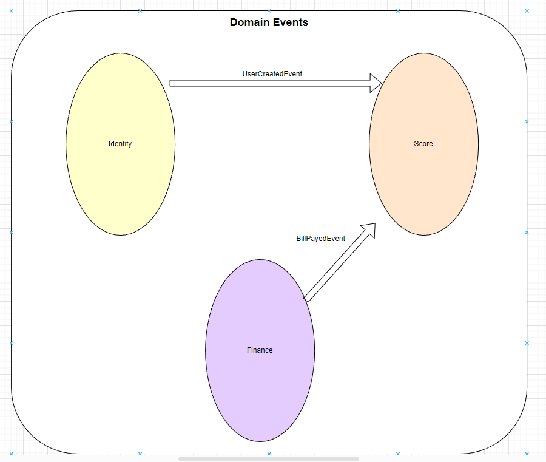

# Projeto Bootcamp Questrade 

Project developed during the Questrade bootcamp, based on a simplified microservices architecture and Docker containers.

## SPA Application (Blazor WebAssembly)



## Getting Started

Make sure you have [installed](https://docs.docker.com/docker-for-windows/install/) and [configured](https://github.com/dotnet-architecture/eShopOnContainers/wiki/Windows-setup#configure-docker) docker in your environment. After that, you can run the below commands from the **/QuestradeApp/** directory and get started immediately.

```powershell
docker-compose build
docker-compose up -d
```

You should be able to browse different components of the application by using the below URLs :

```
Web SPA :  http://localhost:8080/
Identity Api: http://localhost:5522/swagger/index.html
Finance Api: http://localhost:5526/swagger/index.html
Score Api: http://localhost:5524/swagger/index.html
```
### Architecture overview

This application is cross-platform at the server and client-side, thanks to .NET 6 services capable of running on Linux or Windows containers depending on your Docker host, plus any browser for the client web apps.
The architecture proposes a microservice oriented architecture implementation with multiple autonomous microservices (each one owning its own data/db) and using HTTP as the communication protocol between the client apps and the microservices.



## Additional documentation

### Frameworks and Patterns used
#### - Entity Framework Core 6 (ORM)
#### - Mediator Pattern
#### - Entity Framework Core 6 (ORM)
#### - Blazor WebAssembly as SPA Application


### Draws created during the domain modeling brainstorm

#### Domain modeling


#### Aggregates modeling


#### Thinking on domain communication using Domain Events with mediator pattern
